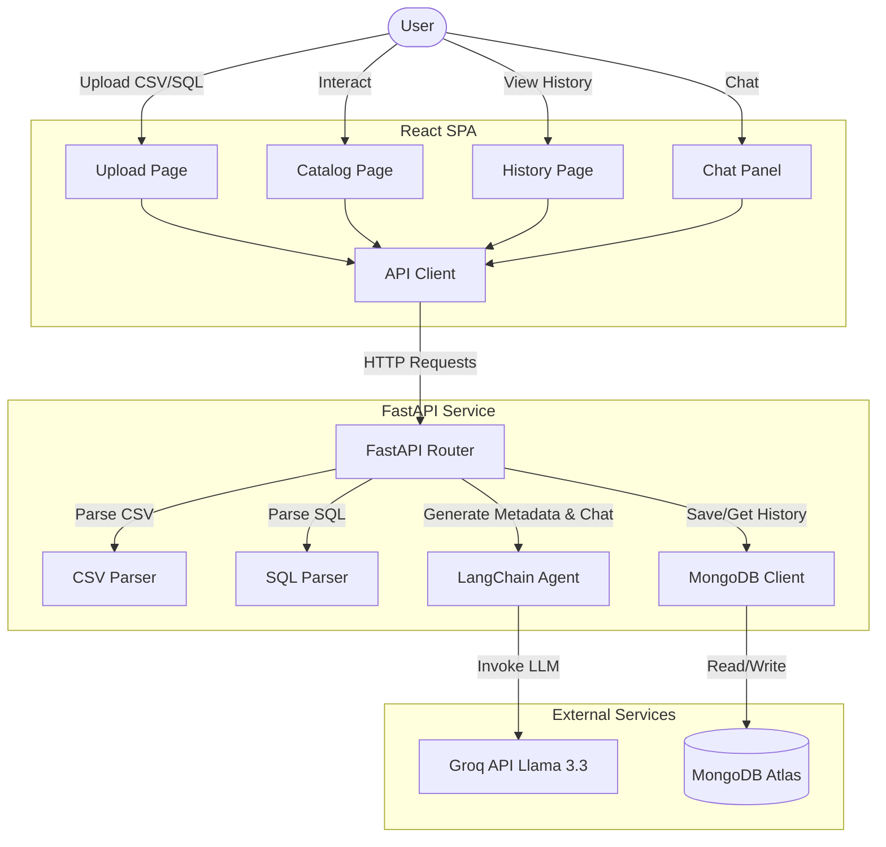

# AI Metadata Catalog Assistant

AI Metadata Catalog Assistant (also known as **MetaCatalog AI**) is a modern web application designed to automatically analyze raw database schemas or CSV datasets and generate intelligent, AI-powered metadata catalogs. 

It automatically classifies column data types, generates human-readable descriptions, evaluates data sensitivity levels, detects PII/Financial/Health data, and offers an interactive conversational assistant to answer questions about the analyzed datasets.

---

## 🏗️ System Architecture

The project consists of a decoupled frontend (React SPA) and backend (FastAPI service). It stores schemas in MongoDB Atlas and utilizes a LangChain agent powered by Groq (Llama-3.3-70b) for metadata generation and interactive chat.



---

## 🌟 Key Features

1. **Schema Parsing**:
   - **CSV Ingestion**: Ingests `.csv` files, parses column names, infers data types, and extracts sample records.
   - **SQL CREATE TABLE Ingestion**: Parses standard SQL `CREATE TABLE` definitions to extract columns and declared SQL data types.
2. **AI-Powered Catalog Generation**:
   - Uses Groq's **Llama-3.3-70b-versatile** model via LangChain to generate human-readable column descriptions.
   - Automatically assigns data type tags (`Numeric`, `Categorical`, `DateTime`, `Boolean`, `Text`, `ID`).
   - Conducts sensitivity screening to assign sensitivity tags (`PII`, `Financial`, `Health`, `Internal`, `Public`) and levels (`High`, `Medium`, `Low`).
3. **Conversational Data Assistant**:
   - Offers a built-in multi-turn chat panel next to the schema catalog to let users ask context-specific questions (e.g., "Which columns contain PII?", "Can I share this data publicly?").
   - Utilizes LangChain's conversational history buffer to maintain stateful dialogue.
4. **Analysis History & Persistence**:
   - Stores all generated schemas and catalogs in MongoDB Atlas.
   - Automatically tracks user history using a persistent client-side UUID (no registration required).

---

## 💻 Tech Stack

### Backend
- **Framework**: FastAPI (Python 3.11+)
- **AI/LLM orchestration**: LangChain / LangChain-Groq
- **Database Client**: PyMongo (MongoDB Atlas)
- **Data Handling**: Pandas (for CSV parsing)
- **SQL Analysis**: sqlparse & custom regex parsing
- **Server**: Uvicorn

### Frontend
- **Framework**: React 19 (Vite, Javascript)
- **Styling**: Tailwind CSS 4
- **Routing**: React Router 7
- **HTTP Client**: Axios
- **Client Identification**: uuid (stored in `localStorage`)

---

## 🚀 Setup & Installation

### Prerequisites
- Python 3.11+
- Node.js 18+
- MongoDB Atlas cluster
- Groq API Key (with access to Llama 3.3)

---

### 1. Backend Setup

1. Navigate to the backend directory:
   ```bash
   cd backend
   ```

2. Create a `.env` file containing:
   ```env
   GROQ_API_KEY=your_groq_api_key_here
   MONGODB_URI=your_mongodb_atlas_connection_string_here
   ```

3. Install requirements:
   ```bash
   pip install -r requirements.txt
   ```

4. Run the development server:
   ```bash
   uvicorn main:app --reload --port 8000
   ```
   The backend API will run at `http://localhost:8000`.

---

### 2. Frontend Setup

1. Navigate to the frontend directory:
   ```bash
   cd frontend
   ```

2. Create a `.env` file containing:
   ```env
   VITE_API_URL=http://localhost:8000
   ```

3. Install dependencies:
   ```bash
   npm install
   ```

4. Run the frontend development server:
   ```bash
   npm run dev
   ```
   The application will run at `http://localhost:5173`.

> 💡 **Note on API Base URL**: The frontend is pre-configured to send requests to `https://ai-metadata-catalog.onrender.com` in [frontend/src/lib/api.js](frontend/src/lib/api.js). For local development against your local backend, make sure to adjust the base URL in that file to match your local port or set up environment variable configuration.

---

## 🐳 Running with Docker (Backend)

A `Dockerfile` is provided for containerizing the backend service.

1. Build the Docker image:
   ```bash
   docker build -t metadata-catalog-backend ./backend
   ```

2. Run the container:
   ```bash
   docker run -p 8000:8000 --env-file ./backend/.env metadata-catalog-backend
   ```

---

## 🔌 API Documentation

The backend exposes the following endpoints:

| Endpoint | Method | Description |
|---|---|---|
| `/` | `GET` | Service status check |
| `/upload/csv` | `POST` | Uploads a CSV file and returns inferred column structures and sample data. |
| `/upload/sql` | `POST` | Parses a SQL `CREATE TABLE` script and returns structured column data. |
| `/generate-metadata` | `POST` | Processes parsed columns through Groq LLM to generate descriptions/classifications, then stores the result in MongoDB Atlas. |
| `/chat` | `POST` | Send a prompt to the conversational assistant for the given schema metadata. |
| `/chat/{session_id}` | `DELETE`| Clears the conversational memory history for a given session. |
| `/history` | `GET` | Retrieves all previously generated metadata catalogs associated with the current user's UUID. |

*Note: All endpoints (except status) require the custom `X-User-Id` header to associate requests with the correct user history.*

---

## 📁 Project Structure

```text
├── backend/
│   ├── main.py            # FastAPI main router, CORS, and endpoint setup
│   ├── agent.py           # LangChain metadata generator & conversational chat assistant
│   ├── parser.py          # CSV processing and SQL parsing engine
│   ├── mongo_client.py    # MongoDB connection and schema collection queries
│   ├── requirements.txt   # Python package dependencies
│   └── Dockerfile         # Backend deployment container recipe
│
├── frontend/
│   ├── package.json       # React / Vite project configuration and scripts
│   ├── index.html         # Application root HTML file
│   ├── tailwind.config.js # CSS configuration
│   └── src/
│       ├── main.jsx       # Frontend client-side entry point
│       ├── App.jsx        # Routing structure & core navbar layout
│       ├── pages/
│       │   ├── Upload.jsx  # Schema/CSV selection and ingestion page
│       │   ├── Catalog.jsx # Metadata visualizer and sidebar conversational assistant
│       │   └── History.jsx # Historic uploads and analysis history overview
│       ├── components/
│       │   ├── ChatPanel.jsx  # Context-aware conversation container
│       │   ├── ColumnCard.jsx # Card view for individual column metadata details
│       │   ├── Table.jsx      # Generic UI table layout for dataset grids
│       │   └── Spinner.jsx    # Smooth loading state animation
│       └── lib/
│           ├── api.js     # Axios API wrapper for communications with the server
│           └── userId.js  # UUID creation and persistence logic (localStorage)
```
